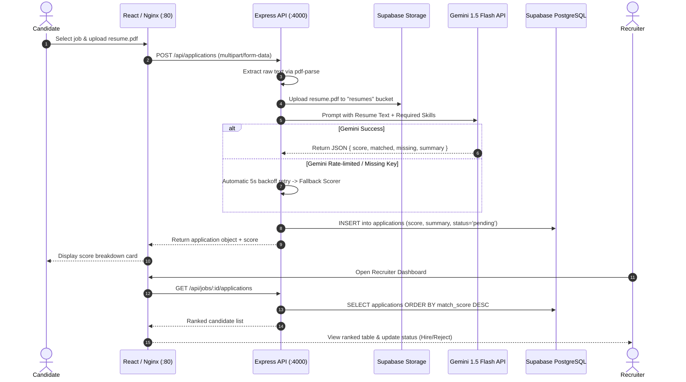

# HireSignal — Agile & DevOps Course Presentation

> **Project:** HireSignal — AI-Driven Recruitment and Candidate Evaluation Platform  
> **Course:** Agile Development & DevOps  
> **Presenter:** Ayush Yadav  
> **Repository:** [ayushheheheha/agile_project](https://github.com/ayushheheheha/agile_project)  
> **Stack:** React (Vite), Express.js (Node 20), Supabase (Postgres, Auth, Storage), Google Gemini 1.5 Flash, Docker, GitHub Actions CI/CD  

---

## Slide Deck Overview

| Slide # | Topic | Key Focus |
|---|---|---|
| **Slide 1** | **Title & Introduction** | Project identity, mission statement, course context |
| **Slide 2** | **The Problem Space & Motivation** | Pain points in traditional recruitment & hiring bottlenecks |
| **Slide 3** | **Product Vision & Solution** | Automated resume-to-job matching, objective scoring, internal tooling aesthetic |
| **Slide 4** | **Agile Framework & Project Planning** | Scrum workflow, User Stories, Story Points (Fibonacci), 72-point backlog |
| **Slide 5** | **Sprint Breakdown & Velocity** | Sprint 1 (Foundations), Sprint 2 (Core Features), Sprint 3 (Polish & Resiliency) |
| **Slide 6** | **Sprint Retrospective & Continuous Improvement** | What went well, impediments solved, actionable course adjustments |
| **Slide 7** | **High-Level System Architecture** | Full-stack topology, client-server-cloud boundary diagram |
| **Slide 8** | **End-to-End Data Flow** | Candidate upload -> PDF parsing -> Gemini scoring -> DB persistence -> Recruiter view |
| **Slide 9** | **DevOps Responsibility Matrix** | Detailed "Who handles what?" across the DevOps lifecycle |
| **Slide 10** | **Continuous Integration (CI Pipeline)** | GitHub Actions: Parallel linting, mocked Jest unit testing, Docker validation |
| **Slide 11** | **Continuous Deployment (CD Pipeline)** | Automated GHCR publishing, downcased tags, multi-stage builds |
| **Slide 12** | **Containerization & Orchestration** | Dockerfile anatomy, multi-stage Vite->Nginx, compose networks & health checks |
| **Slide 13** | **AI Engineering & Fault Tolerance** | Gemini 1.5 Flash prompt design, 429 rate limit backoff, local keyword fallback |
| **Slide 14** | **Live Demonstration Walkthrough** | Recruiter posting & applicant ranking, Candidate submission, Zero-config simulation |
| **Slide 15** | **Conclusion & Key Takeaways** | Engineering learnings, Agile maturity, future production roadmap |

---

## Detailed Slide Content & Speaker Notes

---

### Slide 1: Title & Introduction
**Slide Content:**
- **Title:** HireSignal
- **Subtitle:** An AI-Driven Recruitment & Candidate Evaluation Platform
- **Course:** Agile Development & DevOps
- **Presenter:** Ayush Yadav
- **Core Premise:** Bridging software craftsmanship, Agile project management, and automated DevOps pipelines to solve technical hiring at scale.

**Speaker Script:**
> *"Good morning/afternoon everyone. Today I'm excited to present HireSignal, an AI-driven recruitment and candidate evaluation platform built from the ground up for our Agile Development and DevOps course. While HireSignal delivers a full-stack product for recruiters and candidates, the core focus of this project is demonstrating modern DevOps practices: automated CI/CD pipelines, container orchestration, test-driven resiliency, and structured Agile sprint planning."*

---

### Slide 2: The Problem Space & Motivation
**Slide Content:**
- **The Recruitment Bottleneck:**
  - High volume: Companies receive 250+ applications per open engineering role.
  - Manual review lag: 75% of recruiter time is spent manually scanning resumes.
  - Keyword bias & inconsistency: Traditional ATS systems reject strong candidates based on rigid word filters without semantic understanding.
  - Candidate opacity: Applicants are left in "application black holes" with zero transparency into their alignment or status.

**Speaker Script:**
> *"Hiring teams today face an efficiency crisis. Sifting through hundreds of PDF resumes is slow and error-prone. Legacy Application Tracking Systems rely on naive text matches that miss qualified candidates who used slightly different phrasing. Candidates receive no actionable feedback. HireSignal solves this by pairing modern Generative AI with automated workflows: analyzing real candidate resumes against technical requirements, generating quantitative match scores, and providing transparent feedback to candidates while ranking applicants for recruiters."*

---

### Slide 3: Product Vision & Solution
**Slide Content:**
- **Two Specialized User Journeys:**
  - **Recruiter:** Post technical roles with skill requirements, review applicants ranked by AI match score (0–100), view matched/missing skills, update candidate hiring status (`pending`, `reviewed`, `hired`, `rejected`).
  - **Candidate:** Browse active positions, apply by uploading standard PDF resumes, receive real-time match evaluation and detailed summaries.
- **Design Philosophy:**
  - Dense, functional internal-tool UI (inspired by Linear and GitHub).
  - Zero "AI slop" — clean CSS, readable tabular layouts, instant accessibility.

---

### Slide 4: Agile Framework & Project Planning
**Slide Content:**
- **Scrum Methodology:**
  - 1-week time-boxed sprints.
  - Story point estimation using the **Fibonacci sequence** (1, 2, 3, 5, 8).
  - Total Backlog: **72 Story Points** across 5 functional Epics.
- **Backlog Epics Breakdown:**
  1. **Epic A: Authentication & User Profiles** (14 pts) — Role separation, Supabase JWT auth, route guards.
  2. **Epic B: Job Management** (10 pts) — Job creation, role-based filtering, skill tagging.
  3. **Epic C: Application & Resume Processing** (11 pts) — Multipart upload, in-memory PDF parsing, Supabase Storage.
  4. **Epic D: AI Evaluation Engine** (19 pts) — Gemini prompt engineering, response parsing, rate-limit retries, keyword fallback.
  5. **Epic E: Review & Status Tracking** (18 pts) — Recruiter candidate ranking, status lifecycle, candidate dashboards.

---

### Slide 5: Sprint Breakdown & Velocity
**Slide Content:**

| Sprint | Goal | Points Planned | Actual Delivered | Key Deliverables |
|---|---|---|---|---|
| **Sprint 1** | Foundations & DevOps | 20 + DevOps | 20 pts | Auth (JWT), Supabase DB schema, Docker setup, GitHub Actions CI/CD |
| **Sprint 2** | Core Features & AI | 28 pts | 28 pts | Job posting, PDF upload pipeline, Gemini 1.5 Flash scoring integration |
| **Sprint 3** | AI Resiliency & Polish | 24 pts | 24 pts | 429 rate-limit retry, local keyword fallback, Recruiter ranking table, zero-config simulation |
| **Total** | | **72 pts** | **72 pts** | **100% Sprint Commitment Achieved** |

- **Definition of Done (DoD) Enforced:**
  - Code passes ESLint with 0 warnings.
  - Jest unit tests pass with coverage report.
  - Multi-stage Docker build succeeds.
  - Verified in isolated container environment.

---

### Slide 6: Sprint Retrospective & Continuous Improvement
**Slide Content:**
- **Sprint 1 Retrospective:**
  - *Challenge:* Managing separate environment files across backend and frontend created configuration drift.
  - *Improvement:* Refactored to a **Single Root `.env` Architecture** with automatic Vite and Node path resolution.
- **Sprint 2 Retrospective:**
  - *Challenge:* Free tier Gemini API hit rate limits (~15 RPM) during bulk application testing.
  - *Improvement:* Implemented an automated exponential retry and a transparent local keyword-overlap fallback.
- **Sprint 3 Retrospective:**
  - *Challenge:* Evaluator demo required zero-config onboarding without external database setup.
  - *Improvement:* Built an in-memory full platform simulation script (`backend/simulate.js`) and database seeder.

---

### Slide 7: High-Level System Architecture
**Slide Content:**

```
┌────────────────────────────────────────────────────────────────────────┐
│                              CLIENT TIER                               │
│        React 18 + Vite SPA  (Clean CSS Design System, Responsive)      │
└───────────────────────────────────┬────────────────────────────────────┘
                                    │ HTTP Requests / REST
                                    ▼
┌────────────────────────────────────────────────────────────────────────┐
│                     CONTAINER ORCHESTRATION (Docker)                   │
│                                                                        │
│   ┌───────────────────────────┐         ┌──────────────────────────┐   │
│   │   frontend (Port 80)      │         │   backend (Port 4000)    │   │
│   │   Nginx Alpine Web Server │──/api/─▶│   Node.js + Express API  │   │
│   │   Static Assets & Proxy   │         │   Multer + pdf-parse     │   │
│   └───────────────────────────┘         └─────────────┬────────────┘   │
└───────────────────────────────────────────────────────┼────────────────┘
                                                        │
                      ┌─────────────────────────────────┴─────────────┐
                      ▼                                               ▼
┌──────────────────────────────────────────────┐  ┌───────────────────────┐
│              SUPABASE CLOUD                  │  │       GOOGLE AI       │
│  • PostgreSQL DB (Jobs, Apps, Profiles)      │  │  Gemini 1.5 Flash     │
│  • GoTrue Auth (JWT verification)            │  │  Semantic Resume     │
│  • Storage Bucket ("resumes" PDF storage)    │  │  Scoring & Summary   │
│  • Row-Level Security (RLS) isolation        │  └───────────────────────┘
└──────────────────────────────────────────────┘
```

**Key Architectural Decisions:**
- **Stateless Backend:** Express handles business logic and JWT verification; no in-memory session persistence.
- **In-Memory Buffer Streaming:** Multer uses RAM buffer storage — PDF bytes are parsed directly for AI evaluation and piped to Supabase Storage without writing temporary files to disk.

---

### Slide 8: End-to-End Data Flow
**Slide Content:**



---

### Slide 9: DevOps Responsibility Matrix ("Who Handles What?")
**Slide Content:**

| DevOps Domain | Tool / Technology | Responsibility & Implementation |
|---|---|---|
| **Version Control** | Git & GitHub | Trunk-based development on `main`, atomic commits, pull requests |
| **Code Hygiene** | ESLint v9 (Flat Config) | Automated linting for backend (`.mjs`) & frontend (`.js`/`.jsx`) |
| **Unit & Integration Tests**| Jest | Automated test runner with mocked Gemini client & coverage metrics |
| **Containerization** | Docker | Multi-stage Dockerfiles (`node:20-alpine` & `nginx:alpine`) |
| **Local Orchestration** | Docker Compose | Multi-container setup, custom bridge network, health checks |
| **Continuous Integration** | GitHub Actions (`ci.yml`) | Automated linting, test suite execution, and Docker build check |
| **Continuous Deployment** | GitHub Actions (`cd.yml`) | Automated build & publish to GitHub Container Registry (`ghcr.io`) |
| **Secrets Management** | `.env` & GitHub Secrets | Multi-environment isolation, zero hardcoded credentials |
| **Data Protection** | PostgreSQL RLS | Database-level authorization rules preventing data leakage |

---

### Slide 10: Continuous Integration (CI Pipeline)
**Slide Content:**
- **Trigger:** Any push or Pull Request targeting `main` or `develop`.
- **Pipeline Architecture (`.github/workflows/ci.yml`):**

```
Push / PR
   │
   ▼
[Job 1: ESLint] ──▶ Parallel linting of backend & frontend (zero warnings enforced)
   │ (on success)
   ▼
[Job 2: Jest Tests] ──▶ 14 unit tests run, Gemini API fully mocked, coverage report uploaded
   │ (on success)
   ▼
[Job 3: Docker Build] ──▶ Validates both backend & frontend Dockerfiles compile cleanly
```

- **Why Mock Gemini in CI?**
  - Eliminates external network flakiness.
  - Prevents burning API rate limits during automated builds.
  - Ensures deterministic, fast test runs (< 20 seconds).

---

### Slide 11: Continuous Deployment (CD Pipeline)
**Slide Content:**
- **Trigger:** Merge to `main` branch.
- **Workflow Steps (`.github/workflows/cd.yml`):**
  1. **Build Environment Initialization:** Set up Docker Buildx with GitHub Actions caching (`type=gha`).
  2. **Automated Authentication:** Authenticate to GitHub Container Registry (`ghcr.io`) using the native `GITHUB_TOKEN` with `packages: write` permissions.
  3. **Metadata Extraction:** Tag images with Git commit SHA and `latest`.
  4. **Publish to Registry:** Push production images:
     - `ghcr.io/ayushheheheha/hiresignal-backend:latest`
     - `ghcr.io/ayushheheheha/hiresignal-frontend:latest`

---

### Slide 12: Containerization & Docker Orchestration
**Slide Content:**
- **Backend Dockerfile:**
  - Base: `node:20-alpine` (lightweight footprint ~150MB).
  - Uses `npm ci --only=production` for fast, reproducible builds.
  - Dedicated non-root user execution.
- **Frontend Multi-Stage Dockerfile:**
  - *Stage 1 (Builder):* `node:20-alpine` runs `npm run build` using Vite.
  - *Stage 2 (Runner):* `nginx:alpine` copies only the `/dist` artifacts (~25MB final image).
- **Docker Compose Networking:**
  - Custom isolated bridge network (`app-network`).
  - Nginx reverse-proxies `/api/*` to `http://backend:4000`, eliminating cross-origin browser issues.
  - Backend health check ensures frontend only attaches when the REST API is healthy.

---

### Slide 13: AI Engineering & Fault Tolerance
**Slide Content:**
- **Prompt Engineering Strategy:**
  - System instructions enforce strict JSON-only output conforming to a defined TypeScript schema.
  - Explicit scoring guidelines (0–100) based on required vs. preferred skills.
- **3-Tier Resiliency Architecture:**
  1. **Code Fence Sanitizer (`stripCodeFences`):** Strips markdown wrappers (````json ... ````) often returned by LLMs.
  2. **Rate Limit Handling:** Intercepts HTTP 429 quota exhaustion, performs an automated 5-second backoff, and retries.
  3. **Local Keyword Fallback Scorer:** If the API key is missing or quota is exhausted, seamlessly calculates keyword overlap `(matched / required * 100)`.
  - **Result:** *The user journey never fails or crashes due to external AI downtime.*

---

### Slide 14: Demonstration & Key Features
**Slide Content:**
- **Recruiter Perspective:**
  - Log in as `recruiter@hiresignal.demo`.
  - View dashboard with active positions.
  - Inspect candidate applications ranked by AI match score.
  - Click-to-hire status transition (`pending` -> `reviewed` -> `hired`).
- **Candidate Perspective:**
  - Browse available engineering roles.
  - Upload PDF resume and view instant AI scoring breakdown.
  - Track application status on the candidate portal.
- **Zero-Config Simulation:**
  - Evaluators can run `npm run simulate` in `backend` to view the entire recruitment lifecycle executed with formatted console analytics without any cloud accounts.

---

### Slide 15: Conclusion & Engineering Learnings
**Slide Content:**
- **Key Takeaways:**
  - **Agile Delivery:** Fibonacci estimation and strict Definition of Done prevented scope creep and ensured all 72 story points were delivered.
  - **DevOps Maturity:** Automated CI/CD pipelines caught configuration bugs before production, while Docker provided reliable cross-platform parity.
  - **AI Reliability:** Building fallback mechanisms into AI applications is critical for production readiness.
- **Future Enhancements:**
  - Real-time application updates via Supabase WebSocket channels.
  - Vector embeddings for semantic similarity scoring (pgvector).
  - Automated recruiter email notifications.

---

## Presentation Delivery Tips

1. **Start with the Live App:** Show the clean interface in the browser first for 60 seconds to anchor the audience's attention.
2. **Highlight the DevOps Architecture:** Spend the bulk of time on **Slide 9 (DevOps Matrix)** and **Slide 10/11 (CI/CD Pipelines)** — course evaluators look closely at pipeline automation!
3. **Show the Passing GitHub Actions:** Open the GitHub Actions tab on your repository to prove that ESLint, Jest, and Docker builds are green.
4. **Mention the Fault-Tolerance:** Explain *why* your app doesn't break if Gemini runs out of quota — professors love graceful degradation.
